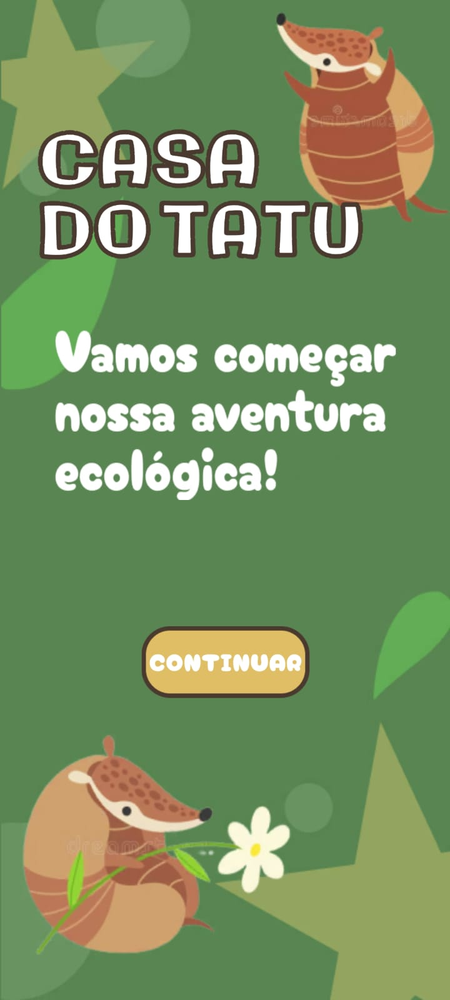
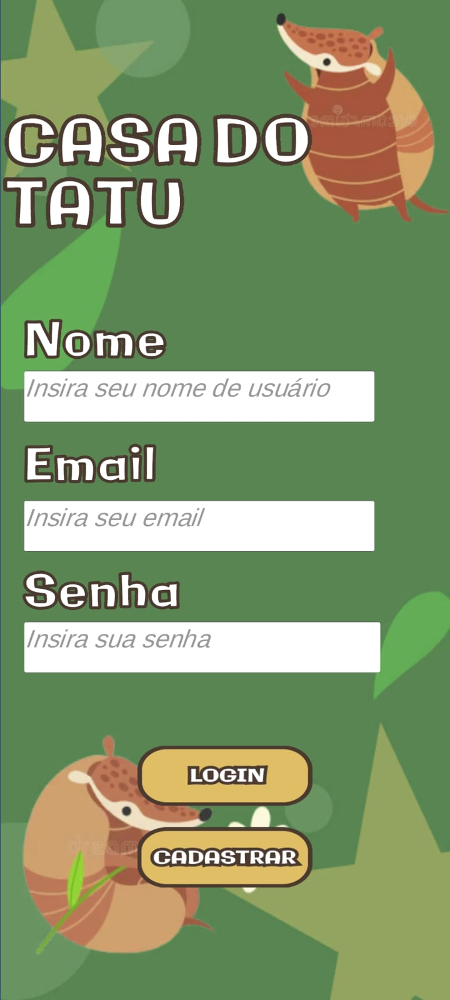

# Casa do Tatu
Este Readme contém informações e instruções sobre o projeto Casa do Tatu, desenvolvido no
Unity.

## Descrição
O projeto foi desenvolvido no Unity, uma plataforma de desenvolvimento de jogos e aplicativos
em 2D e 3D. O objetivo do projeto é incentivar as crianças por meio de uma aplicação gamificada
e lúdica à preservação ambiental com o foco na ilha de Cotijuba. A gamificação irá compreer 
inúmeros mini-games que busquem fazer a correlação com a problemática envolvida, assim sendo
promovendo o pensamento crítico sobre tal.

## Prévia da aplicação

Tela inicial

Tela de Login

## Requisitos
Para rodar o projeto, é necessário ter instalado na máquina:

● Unity 2021.3.20

## Como rodar o projeto
Para rodar o projeto, siga os seguintes passos:
1. Faça o clone do repositório em sua máquina.
2. Abra o Unity Hub e selecione o projeto.
3. Aguarde o Unity importar todos os arquivos do projeto.
4. Clique em "Play" para rodar o projeto.

## Autores
● Wagner Wendell Silva Ribeiro Filho (linkedin.com/in/wagner-filho-03b343232) -
Desenvolvedor

● Fabricio José Souza Silva (linkedin.com/in/fabricio-silva-2a96a5207) - Desenvolvedor

● Jairo Cesar Santos De Jesus Júnior
(linkedin.com/in/jairo-cesar-santos-de-jesus-júnior-6269bb232) - Desenvolvedor

● Muriel Áquila Pantoja Silva (linkedin.com/in/vitória-suely-silva-2634a3210) - Artista

● Amora Sofia da Paixão (linkedin.com/in/edson-paixão-b91730214) - Artigo

## Licença
Este projeto está licenciado sob a licença MIT - veja o arquivo LICENSE.md para mais detalhes.
